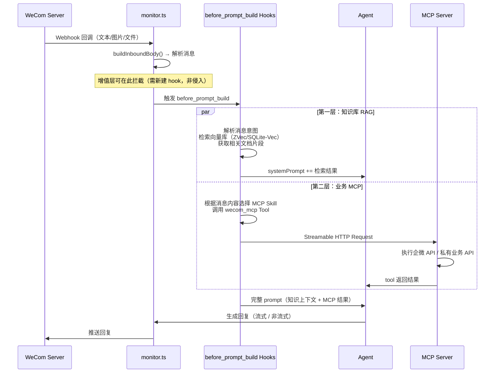
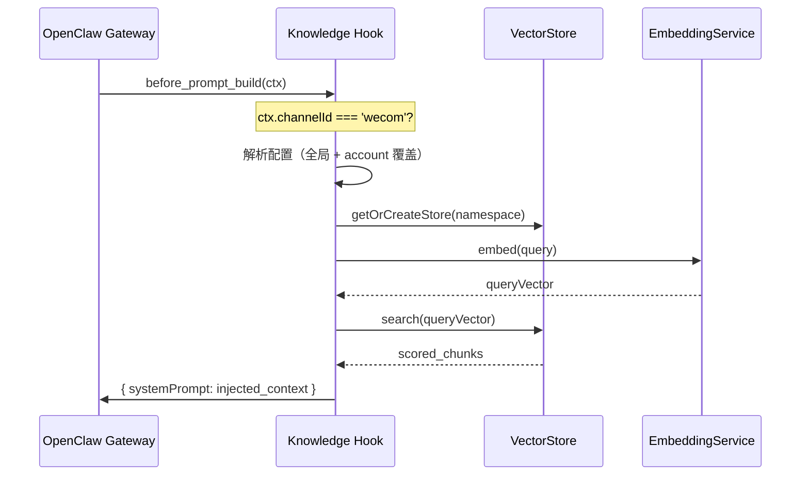
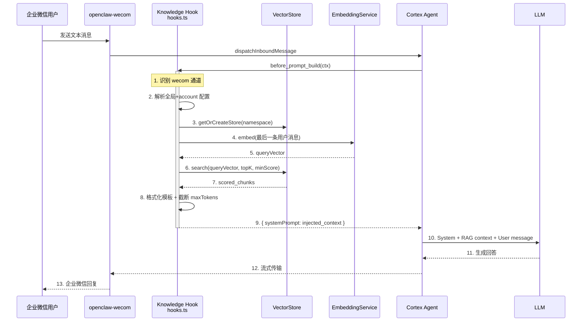

# OpenClaw-WeCom 知识库 RAG 架构设计文档

> **OpenClaw-WeCom Knowledge RAG = 企业微信 AI 机器人的知识库增强插件。**
>
> 它基于 OpenClaw 的 `before_prompt_build` hook 机制，为企微 Bot 与 Agent 双模式对话注入向量检索增强生成（RAG）上下文，实现**文件自动入库、语义检索、多租户隔离**的一站式知识管理。

[](#)
[](#)
[](#)

---

**文档约定**：本文以 `@partme.ai/openclaw-wecom` 为代码基线，定义知识库 RAG 插件的架构设计、模块划分、配置模型与实现落点。「插件」即指 `openclaw-wecom` 内置的知识库 RAG 子模块；默认运行环境为 Node.js / TypeScript，插件宿主为 OpenClaw Gateway。

**实现状态标签**：
- `[已实现]`：仓库已完成的模块
- `[目标态]`：本文定义的目标能力

---

## 目录

### Part I：战略定位与核心价值
- 1. 为什么需要知识库 RAG
- 2. 在 OpenClaw 插件生态中的位置
- 3. 三条硬约束与总体架构
- 4. 两层增值能力架构总览

### Part II：架构总览——Hook 注入模型
- 5. OpenClaw 的 `before_prompt_build` Hook 回顾
- 6. RAG 注入的四层职责
- 7. 核心工作流：索引、检索、注入
  - 7.1 通路 A：用户上传文件 → 对话级索引
  - 7.2 检索工作流
  - 7.3 命名空间隔离与数据来源隔离
  - 7.4 通路 B：企微文档拉取 → 企业级知识库

### Part III：核心技术实现
- 8. 模块划分与目录结构
- 9. Embedding 服务层
- 10. 向量存储层与多后端支持
- 11. 文本切分（Chunker）与文档索引
- 12. 混合检索（Hybrid Retriever）
- 13. 配置模型与深度合并
- 14. 生命周期、缓存与多租户隔离

### Part IV：双模式侵入点
- 15. Agent 模式：文件入库索引
- 16. Bot 模式：消息触发索引
- 17. `before_prompt_build` Hook 配置读取

### Part V：部署与配置
- 18. 最小配置
- 19. 多租户配置
- 20. 运维诊断

### Part VI：附录
- 附录 A：术语表
- 附录 B：配置参考
- 附录 C：支持的向量数据库

---

# Part I：战略定位与核心价值

## 1. 为什么需要知识库 RAG

企业微信 AI 机器人在实际场景中频繁遇到以下痛点：

| 痛点 | 场景 | 解决方案 |
|------|------|----------|
| **知识孤岛** | 机器人回答客户问题时，无法引用公司内部文档 | RAG 将文档嵌入向量库，对话时检索注入 |
| **文件浪费** | 用户上传的文件被丢弃，无法沉淀为知识资产 | 自动索引上传的文件到知识库 |
| **多租户混淆** | 多个企业使用同一个实例，知识互相污染 | 命名空间隔离，按 `accountId:mode` 分离 |
| **响应机械** | 机器人只能靠预训练数据回答，不能引用最新文档 | RAG 实时检索，回答可溯源 |

`openclaw-wecom` 的知识库 RAG 插件解决了这些问题，提供了一个**零配置启动、轻量内置、可选外部扩展**的知识检索方案。

### 1.1 三大非妥协目标

| 目标 | 强约束 | 体现 |
|------|--------|------|
| **零依赖起步** | 不依赖外部服务即可运行 | 内置 ZVec（纯 JS 向量引擎）、OpenAI 兼容 Embedding API |
| **多租户安全** | 不同客户/场景的知识必须严格隔离 | 命名空间 `accountId:mode`，配置按 account 深度合并 |
| **最小侵入** | 不破坏原有 Bot/Agent 的主流程 | 4 个侵入点总计 ~125 行，try/catch 兜底 |

### 1.2 非目标

- 不替代专业向量数据库（Pinecone/Weaviate 等）的高性能场景；
- 不通用的文档格式支持（如 Office/PDF 需要额外转换层）；
- 不在插件内实现知识库管理 UI（由 OpenClaw 管理面板提供）。

## 2. 在 OpenClaw 插件生态中的位置

`openclaw-wecom` 本身是一个 **Channel Plugin**，知识库 RAG 是其内置的增值子模块，通过 `before_prompt_build` hook 与路由无关的方式注入。

```mermaid
graph TB
    subgraph OC[OpenClaw Gateway]
        direction TB
        CTX[Cortex<br/>Agent 调度]
        SES[Session Bus<br/>会话管理]
    end

    subgraph CP[Channel Plugins]
        direction TB
        WX[wecom 企业微信]
        GF[gotify 消息推送]
        MT[matrix 即时通讯]
        DP[...]
    end

    subgraph WXINNER[openclaw-wecom]
        direction LR
        BOT[Bot 流式对话]
        AGT[Agent 自建应用]
        KR[Knowledge RAG<br/>◄ 本文聚焦]
    end

    CTX --> WX
    CTX --> GF
    CTX --> MT
    CTX --> DP
    WX --> BOT
    WX --> AGT
    WX --> KR

    style KR fill:#1a3a2a,stroke:#34d399,stroke-width:2px
    style OC fill:#0f2937,stroke:#22d3ee,stroke-width:1px
    style CP fill:#111827,stroke:#475569,stroke-width:1px
```



## 3. 三条硬约束与总体架构

### 3.1 硬约束 A：OpenClaw Hook 契约不可违反

| 契约 | 要求 | 落点 |
|------|------|------|
| `before_prompt_build` 事件 | 只能返回 `systemPrompt` 或 `userPrompt`，不可修改原始请求 | `handleBeforePromptBuild` |
| Hook 的 `ctx` 类型 | `PluginHookAgentContext`，无 `config` 字段 | 配置读取绕过 ctx，使用插件 API |
| 事件执行顺序 | 多个 hook 按注册顺序执行，不可阻塞主流程 | try/catch 包裹所有逻辑，失败静默返回 `undefined` |

### 3.2 硬约束 B：存储后端必须可切换

| 后端类型 | 场景 | 实现状态 |
|----------|------|----------|
| **ZVec**（纯 JS 内存引擎） | 零依赖快速启动 | `[已实现]` |
| **SQLite-Vec**（本地持久化） | 轻量生产方案 | `[已实现]` |
| Redis / Pinecone / Chroma / Weaviate / Qdrant / Milvus / pgvector | 高性能/分布式 | `[目标态]` |

### 3.3 硬约束 C：双模式下行为一致

| 模式 | 触发索引 | 触发检索 | 命名空间 |
|------|----------|----------|----------|
| **Bot**（智能体） | 用户上传文件 → 自动索引 | 每次对话 → `before_prompt_build` | `accountId:bot` |
| **Agent**（自建应用） | 用户上传文件 → 自动索引 | 同上 | `accountId:agent` |

## 4. 两层增值能力架构总览

> 本文聚焦的"知识库 RAG"是增值能力的第一层。与之并行的是第二层——**业务 MCP** ——两者通过 OpenClaw 的 `before_prompt_build` hook 机制共同注入。

### 4.1 两层能力模型

`@mocrane/wecom` 的商业增值基于"让 AI 有脑子"和"让 AI 能干活"两条主线展开：

| 层级 | 能力 | 核心组件 | 注入方式 | 解决什么问题 |
|------|------|----------|----------|-------------|
| **第一层** | 知识库 RAG | `src/knowledge/`（Chunker + Embedding + Vector Store + Retriever） | `before_prompt_build` hook → `systemPrompt` | 让 AI 回复时能查企业文档、查群聊历史，不凭空编造 |
| **第二层** | 业务 MCP | `src/mcp/`（Streamable HTTP Transport + Tool Registry） + `skills/`（11个企微技能） | 通过 Agent Tool 注册 | 让 AI 能操作企微数据（文档/通讯录/会议/日程/待办），未来接入企业私有业务系统 |

### 4.2 在消息流中的位置

两层能力在 Bot + Agent 双模式消息流中的注入点不同：



### 4.3 与本文的关系

本文的**核心主题是第一层（知识库 RAG）的实现细节**。第二层（业务 MCP）仅在架构总览中介绍其存在和与 RAG 的协同关系，详细的 MCP 架构设计、Skill 注册机制、私有业务系统接入方案，请参考：

|- `docs/OpenClaw-WeCom-Knowledge-RAG-Strategy_CN.md` — 商业增值策略与三层能力模型，含扩展点说明和版本发布策略

### 4.4 纯加法原则

两层增值能力均遵循**纯加法原则**：
- 不修改 `monitor.ts`（2993行核心消息流）的已有逻辑
- 不修改 `channel.ts` 的 ChannelPlugin 生命周期
- 第一层通过 `before_prompt_build` hook 注入
- 第二层通过 `src/mcp/` 扩展新 MCP 品类 + `skills/` 新增技能描述
- 配置使用深度合并（全局配置兜底，account 级覆盖）

---

# Part II：架构总览——Hook 注入模型

## 5. OpenClaw 的 `before_prompt_build` Hook 回顾

OpenClaw 在构建 Agent 请求（拼接历史、系统提示、工具列表等）之前，按顺序触发所有已注册的 `before_prompt_build` 事件。每个处理器可以返回 `{ systemPrompt: string }` 或 `{ userPrompt: string }`，OpenClaw 会将这些内容叠加到最终的请求中。



## 6. RAG 注入的四层职责

| 层次 | 职责 | 实现组件 |
|------|------|----------|
| **Hook 适配层** | 监听 `before_prompt_build`，解析配置，执行检索注入 | `src/knowledge/hooks.ts` |
| **索引层** | 文档读取 → 切分 → 嵌入 → 存储 | `src/knowledge/indexer/` |
| **检索层** | 向量检索 + 关键词增强混合检索 | `src/knowledge/retriever/` |
| **基础设施层** | Embedding 调用、向量存储、配置合并 | `src/knowledge/embedding/`、`src/knowledge/store/` |

## 7. 核心工作流：索引、检索、注入

### 7.1 索引工作流（通路 A：用户上传文件 → 对话级索引）

> **数据来源：通路 A** — 用户发给 Bot/Agent 的文件，索引到该用户 `accountId:mode` 的**私有命名空间**，仅作为当前对话上下文使用，**不沉淀为企业业务知识**。

```mermaid
flowchart TD
    U[用户发送文件到企微] --> M[企微回调 → Bot/Agent 处理<br/>monitor.ts / agent/handler.ts]
    M --> D[下载文件到本地<br/>media.ts decryptMedia]
    D --> Q{是否可索引<br/>文本文件?}
    Q -->|否| S[跳过索引<br/>继续正常对话]
    Q -->|是<br/>.md .txt .csv .json| C[chunkText 切分<br/>按 chunkSize/chunkOverlap]
    C --> E[embedding.embedBatch<br/>批量向量化]
    E --> V[写入 VectorStore<br/>命名空间 accountId:mode<br/>◄ 仅影响当前用户私有空间]
    V --> L[记录日志<br/>[KNOWLEDGE] 通路A 索引成功]
    L --> N[继续原有对话流程]
    S --> N

    style V fill:#1a3a2a,stroke:#34d399,stroke-width:2px
    style C fill:#0f2937,stroke:#22d3ee,stroke-width:1px
    style E fill:#0f2937,stroke:#22d3ee,stroke-width:1px
```

### 7.2 检索工作流（用户提问 → 注入上下文）



### 7.3 命名空间隔离与数据来源隔离

每个命名空间 `{accountId}:{mode}` 拥有独立的 VectorStore 实例，知识数据完全隔离。

| accountId | mode | 命名空间 | 隔离说明 |
|-----------|------|----------|----------|
| `default` | `bot` | `default:bot` | 默认的 Bot 模式知识库 |
| `default` | `agent` | `default:agent` | 默认的 Agent 模式知识库 |
| `acme_corp` | `bot` | `acme_corp:bot` | acme_corp 租户的 Bot 知识库 |
| `acme_corp` | `agent` | `acme_corp:agent` | acme_corp 租户的 Agent 知识库 |

**两条数据通路写入不同 namespace**：

| 通路 | 数据源 | 写入命名空间模式 | 说明 |
|------|--------|-------------------|------|
| **通路 A** | 用户上传文件（Bot/Agent 消息中的附件） | `{accountId}:bot` 或 `{accountId}:agent` | 对话级私有空间，用户只能影响自己的 namespace |
| **通路 B** | 企微文档 API 拉取（管理员指定文档库） | `{accountId}:enterprise`（建议） | 企业级全局知识空间，需要管理员显式授权 |

> **设计约束**：通路 A 和通路 B 写入**不同的 namespace**，数据不混淆。通路 A 不需要额外 API 权限；通路 B 需要企微文档 `doc/get_doc_content` 等 MCP API 权限，且配置中必须显式指定文档库的 `folderId`/`docId`。

### 7.4 索引工作流（通路 B：企微文档拉取 → 企业级知识库）

> **数据来源：通路 B** — 由管理员指定 `accountId` 的授权账户，通过企微文档 API 主动拉取，索引到该 `accountId` 的**企业级全局知识空间**，对租户内所有用户可见。

**前提**：
- 配置中必须指定企微文档库 ID（`folderId`/`docId`）
- 需要额外的企微 API 权限（`doc/get_doc_content` 等 MCP Skill）
- 需要管理员对目标 `accountId` 进行授权

**流程**：

```mermaid
flowchart TD
    A[管理员配置<br/>folderId/docId 列表] --> B[定时调度器触发<br/>scheduler.ts]
    B --> C[调用企微 MCP API<br/>doc/get_doc_content]
    C --> D{API 调用成功?}
    D -->|否| E[记录错误<br/>跳过本轮同步]
    D -->|是| F[获取文档内容<br/>Markdown/HTML]
    F --> G[chunkText 切分<br/>按 chunkSize/chunkOverlap]
    G --> H[embedding.embedBatch<br/>批量向量化]
    H --> I[写入 VectorStore<br/>命名空间 accountId:enterprise<br/>◄ 全局知识空间，非对话级]
    I --> J[记录日志<br/>[KNOWLEDGE] 通路B 同步成功]
    J --> K[更新同步状态<br/>记录 lastSyncTime / etag]

    subgraph 隔离说明
        L[通路 B 写入 <b>accountId:enterprise</b><br/>通路 A 写入 <b>accountId:bot/agent</b><br/>两路数据完全隔离]
    end

    style I fill:#1a3a2a,stroke:#34d399,stroke-width:2px
    style C fill:#0f2937,stroke:#f59e0b,stroke-width:2px
    style A fill:#0f2937,stroke:#f59e0b,stroke-width:1px
```

**关键区别（vs 通路 A）**：

| 维度 | 通路 A（用户上传 → 对话级） | 通路 B（企微文档拉取 → 企业级） |
|------|---------------------------|-------------------------------|
| **触发方式** | 用户发送文件到对话 | 定时任务 + 管理员配置 |
| **API 依赖** | 无额外 API 权限 | 需要 `doc/get_doc_content` 等 MCP Skill |
| **数据范围** | 单个用户的单次上传 | 企业文档库中的全部文档 |
| **索引目标** | `namespace = accountId:mode`（对话级） | `namespace = accountId:enterprise`（企业级） |
| **可见性** | 仅当前对话/当前用户 | 该 accountId 下所有用户 |
| **配置要求** | 无额外配置 | 必须指定 `folderId`/`docId` |
| **误用风险** | 低 — 用户只能影响自己的 namespace | **高** — 误将对话文件全量推入会污染企业知识库 |

---

# Part III：核心技术实现

## 8. 模块划分与目录结构

```
openclaw-wecom/
├── src/knowledge/                    # 知识库 RAG 模块（独立子模块）
│   ├── types.ts                      # 核心类型定义
│   ├── hooks.ts                      # Hook 注册 + 配置合并 + 生命周期
│   ├── index.ts                      # 公共导出
│   │
│   ├── embedding/                    # Embedding 服务层
│   │   └── openai.ts                 #   OpenAI 兼容 API 实现
│   │
│   ├── store/                        # 向量存储层
│   │   ├── factory.ts                #   工厂模式创建 VectorStore
│   │   ├── zvec.ts                   #   纯 JS 内存向量引擎
│   │   ├── sqlite-vec.ts             #   SQLite 持久化向量引擎
│   │   └── math.ts                   #   相似度计算工具
│   │
│   ├── indexer/                      # 文档索引层
│   │   ├── chunker.ts                #   文本切分器
│   │   └── scheduler.ts              #   索引调度器（加载→切分→嵌入→存储）
│   │
│   └── retriever/                    # 检索层
│       └── hybrid.ts                 #   混合检索（向量 + BM25 关键词）
│
├── src/config/schema.ts              # Zod schema（含 knowledge 配置项）
├── src/types/config.ts               # WecomConfig 类型定义
└── index.ts                          # 插件入口（含 registerKnowledgeHooks 调用）
```

## 9. Embedding 服务层

`OpenAIEmbeddingService` 实现 `EmbeddingService` 接口，支持任何 OpenAI 兼容的 Embedding API。

```typescript
export class OpenAIEmbeddingService implements EmbeddingService {
  readonly dimensions: number;
  readonly modelName: string;

  constructor(config: KnowledgeEmbeddingConfig) {
    // 默认复用 LLM 配置端点，支持自定义 baseUrl/apiKey/model
  }

  async embed(text: string): Promise<number[]>;
  async embedBatch(texts: string[]): Promise<number[][]>;
  async health(): Promise<boolean>;
}
```

**配置示例**：

```json
{
  "embedding": {
    "provider": "openai",
    "baseUrl": "https://api.openai.com/v1",
    "apiKey": "sk-xxx",
    "model": "text-embedding-3-small",
    "dimensions": 1536
  }
}
```

**设计要点**：
- 未显式配置 `baseUrl`/`apiKey` 时，自动复用 LLM 的 OpenAI 兼容配置；
- `dimensions` 需与向量存储的维度对齐，写错会导致 `upsert` 失败；
- 批量嵌入自动将长文本按 token 上限分片（默认 8192 tokens）。

## 10. 向量存储层与多后端支持

### 9.1 VectorStore 接口

```typescript
export interface VectorStore {
  initialize(): Promise<void>;
  upsert(chunks: VectorChunk[]): Promise<void>;
  upsertBatch(chunks: VectorChunk[], batchSize?: number): Promise<void>;
  search(vector: number[], options?: SearchOptions): Promise<ScoredChunk[]>;
  deleteBySource(sourceId: string): Promise<void>;
  clear(): Promise<void>;
  stats(): Promise<StoreStats>;
}
```

### 9.2 内置引擎

| 引擎 | 存储模式 | 适用场景 | 依赖 |
|------|----------|----------|------|
| **ZVec** | 内存 | 开发/测试/小规模（<1000 文档） | 零依赖 |
| **SQLite-Vec** | 磁盘持久化 | 轻量生产（<10万 文档） | `better-sqlite3` |

### 9.3 外部引擎（目标态）

| 引擎 | 适用场景 | 连接方式 |
|------|----------|----------|
| Redis | 内存缓存/快速检索 | `redisUri` |
| Pinecone | 云原生向量数据库 | `pineconeApiKey` + `pineconeEnvironment` |
| Chroma | 本地/嵌入式 | `url` |
| Weaviate | 混合搜索（向量+标量） | `url` |
| Qdrant | 高性能向量检索 | `url` |
| Milvus | 大规模向量搜索 | `url` |
| pgvector | 与现有 PostgreSQL 集成 | `url` + `pgvectorIndexType` |

**引擎选择指导**：

```
你的环境
├─ 开发/测试          → ZVec（零配置）
├─ 单机轻量生产        → SQLite-Vec
├─ 已有 PostgreSQL    → pgvector
├─ 云原生/高可用       → Pinecone / Weaviate / Qdrant
└─ 大规模/多租户       → Milvus / Elasticsearch
```

## 11. 文本切分（Chunker）与文档索引

### 10.1 Chunker 配置

```typescript
export type ChunkerConfig = {
  strategy: 'recursive' | 'fixed' | 'markdown';
  chunkSize: number;     // 默认 1000 字符
  chunkOverlap: number;  // 默认 200 字符
  separators?: string[]; // 递归切分分隔符优先级
};
```

| 策略 | 适用场景 | 说明 |
|------|----------|------|
| `recursive` | 纯文本/代码（默认） | 按 `\n\n` → `\n` → `.` → ` ` 递归切分 |
| `fixed` | 结构规整的数据 | 固定字符数切分，强制对齐 |
| `markdown` | Markdown 文档 | 按标题（`#`）分割段落 |

### 10.2 索引调度器

`indexDocument()` 一站式完成：读取文件 → 切分 → 嵌入 → 存储。

```typescript
async function indexDocument(
  filePath: string,
  sourceId: string,
  embedding: EmbeddingService,
  store: VectorStore,
  chunkerConfig?: Partial<ChunkerConfig>,
): Promise<IndexResult>;
```

**支持的文件格式**：`.md`、`.txt`、`.csv`、`.json`

**索引流程**：
1. 读取文件内容（UTF-8）
2. 调用 `chunkText()` 切分
3. 批量调用 `embedding.embedBatch()` 生成向量
4. 先 `deleteBySource()` 清除旧数据
5. 批量 `upsert()` 写入

## 12. 混合检索（Hybrid Retriever）

### 11.1 检索策略

| 策略 | 说明 | 适用场景 |
|------|------|----------|
| `vector` | 纯向量余弦相似度 | 语义匹配（同义词、语义相似） |
| `keyword` | BM25 关键词匹配 | 精确匹配（产品名、编号） |
| `hybrid` | 向量 + 关键词加权融合（默认） | 大多数场景 |

### 11.2 混合检索实现

```typescript
async function hybridSearch(
  query: string,
  embedding: EmbeddingService,
  store: VectorStore,
  options: {
    topK: number;        // 默认 5
    minScore: number;    // 默认 0.0
    strategy: 'vector' | 'keyword' | 'hybrid';
    keywordWeight?: number; // 默认 0.3
  },
): Promise<RagContextResult>;
```

**混合策略**：
1. 向量检索 topK 结果 → 余弦相似度评分
2. BM25 关键词检索 topK 结果 → 词频评分
3. `score = vectorScore * (1 - keywordWeight) + keywordScore * keywordWeight`
4. 按加权评分排序，取最优 topK

## 13. 配置模型与深度合并

### 12.1 全局配置

```json
{
  "channels": {
    "wecom": {
      "knowledge": {
        "enabled": true,
        "embedding": { "model": "text-embedding-3-small" },
        "store": { "provider": "zvec" },
        "retrieval": { "topK": 5, "strategy": "hybrid" },
        "injection": {
          "position": "system",
          "template": "以下是相关知识库内容：\n\n{context}"
        }
      }
    }
  }
}
```

### 12.2 Account 级覆盖

```json
{
  "channels": {
    "wecom": {
      "knowledge": { "enabled": true, "...": "..." },
      "accounts": {
        "tenant_a": {
          "knowledge": {
            "store": {
              "provider": "sqlite-vec",
              "dbPath": "/data/tenant_a_knowledge.db"
            },
            "retrieval": { "topK": 10 }
          }
        }
      }
    }
  }
}
```

### 12.3 合并规则

| 字段 | 合并策略 |
|------|----------|
| `enabled` | 继承全局，account 级不可覆盖 |
| `embedding` | 深度合并（account 级字段覆盖全局同名字段） |
| `store` | 深度合并，但 `sources` 字段完全替换 |
| `retrieval` | 深度合并 |
| `injection` | 深度合并 |
| `moderation` | 深度合并 |

## 14. 生命周期、缓存与多租户隔离

### 13.1 Store 实例缓存

`getOrCreateStore()` 按 `namespace` 缓存 VectorStore 实例：

```typescript
const storeCache = new Map<string, { store: VectorStore; embedding: EmbeddingService; config: KnowledgeConfig }>();

async function getOrCreateStore(config: KnowledgeConfig, namespace: string) {
  const cached = storeCache.get(namespace);
  if (cached) return cached;

  const embedding = new OpenAIEmbeddingService(config.embedding);
  const store = await createVectorStore(config.store, config.embedding.dimensions);
  storeCache.set(namespace, { store, embedding, config });
  return { store, embedding };
}
```

### 13.2 缓存失效

```typescript
// 清除单个命名空间
invalidateStoreCache('default:bot');

// 清除所有缓存（配置变更后调用）
invalidateStoreCache();
```

### 13.3 多租户隔离矩阵

| 维度 | 隔离方式 |
|------|----------|
| Account 级别 | 命名空间 `accountId:mode` |
| Bot vs Agent | 命名空间 mode 区分 |
| 配置 | 深度合并，account 级可完全独立 |
| 存储文件 | ZVec 内存不同实例；SQLite-Vec 不同 `.db` 文件 |

---

# Part IV：双模式侵入点

> 详见 [开发者指南](./OpenClaw-WeCom-Knowledge-RAG-Development_CN.md) 第 8.4 节「侵入式修改的规范」，本章仅做概要。

## 15. Agent 模式：文件入库索引

**位置**：`src/agent/handler.ts`，`processAgentMessage()` 文件下载块后。

**逻辑**：
1. 判断文件类型是否可索引（`.md`/`.txt`/`.csv`/`.json`）
2. 如果是 → 读取内容 → chunk → embed → 写入 VectorStore
3. 异常降级（try/catch，失败只打日志，不阻塞对话）

## 16. Bot 模式：消息触发索引

**位置**：`src/monitor.ts`，`startAgentForStream()` 中 `processInboundMessage` 调用后。

**逻辑**：与 Agent 模式相同，仅在解密下载完成后插入。

## 17. `before_prompt_build` Hook 配置读取

**问题**：hook 的 `ctx` 类型不包含 `config` 字段。

**方案**：通过 `api.config.get?.()` 获取完整运行时配置，或插件注册时捕获一次配置引用。

---

# Part V：部署与配置

## 18. 最小配置

```json
{
  "channels": {
    "wecom": {
      "knowledge": {
        "enabled": true,
        "embedding": {
          "baseUrl": "https://api.openai.com/v1",
          "apiKey": "sk-xxx",
          "model": "text-embedding-3-small"
        },
        "store": {
          "provider": "zvec"
        }
      }
    }
  }
}
```

## 19. 多租户配置

```json
{
  "channels": {
    "wecom": {
      "knowledge": {
        "enabled": true,
        "embedding": { "model": "text-embedding-3-small" },
        "store": { "provider": "sqlite-vec" },
        "retrieval": { "topK": 5 },
        "injection": {
          "position": "system",
          "template": "以下是相关知识库内容：\n\n{context}"
        }
      },
      "accounts": {
        "acme": {
          "store": {
            "dbPath": "/data/knowledge/acme.db"
          },
          "retrieval": { "topK": 10 }
        },
        "globex": {
          "store": {
            "dbPath": "/data/knowledge/globex.db"
          }
        }
      }
    }
  }
}
```

## 20. 运维诊断

```bash
# 查看知识库状态（通过 OpenClaw doctor）
openclaw doctor --channel wecom

# 手动触发索引（通过插件内置命令）
openclaw run knowledge:index --path /docs/manual.md

# 清空知识库（特定租户）
openclaw run knowledge:clear --namespace acme:bot

# 查看知识库统计
openclaw run knowledge:stats
```

---

# Part VI：附录

## 附录 A：术语表

| 术语 | 定义 |
|------|------|
| RAG | Retrieval-Augmented Generation，检索增强生成 |
| Embedding | 将文本转换为向量表示的技术 |
| VectorStore | 向量数据库存储和检索引擎 |
| Chunk | 文本切分后的片段 |
| Chunker | 文本切分器 |
| ZVec | 纯 JavaScript 实现的轻量向量引擎 |
| Namespace | 命名空间，用于多租户数据隔离 |
| before_prompt_build | OpenClaw 在构建请求前触发的 hook 事件 |
| **通路 A** | 用户上传文件 → 对话级索引，写入 `accountId:mode` 私有 namespace |
| **通路 B** | 企微文档 API 拉取 → 企业级知识库，写入 `accountId:enterprise` namespace |

## 附录 B：配置参考

### `channels.wecom.knowledge` 配置项

| 字段 | 类型 | 必需 | 默认值 | 说明 |
|------|------|------|--------|------|
| `enabled` | boolean | 是 | `false` | 是否启用知识库 |
| `embedding.provider` | string | 否 | `"openai"` | Embedding 提供商 |
| `embedding.baseUrl` | string | 否 | 复用 LLM 配置 | API 端点 |
| `embedding.apiKey` | string | 否 | 复用 LLM 配置 | API 密钥 |
| `embedding.model` | string | 否 | `"text-embedding-3-small"` | 嵌入模型 |
| `embedding.dimensions` | number | 否 | 模型默认 | 向量维度 |
| `store.provider` | string | 是 | `"zvec"` | 存储引擎 |
| `store.dbPath` | string | 否 | 随引擎自动 | SQLite-Vec 数据库路径 |
| `store.sources` | object | 否 | - | 文档来源配置 |
| `retrieval.topK` | number | 否 | `5` | 返回 topK 结果 |
| `retrieval.minScore` | number | 否 | `0.0` | 相似度阈值 |
| `retrieval.strategy` | string | 否 | `"hybrid"` | 检索策略 |
| `injection.position` | string | 否 | `"system"` | 注入位置（system/user） |
| `injection.template` | string | 否 | 见下文 | 上下文模板 |
| `moderation.enabled` | boolean | 否 | `false` | 内容审核（预留） |

**默认注入模板**：

```
以下是相关知识库内容，请据此回答用户问题：

{context}
```

## 附录 C：支持的向量数据库

| 引擎 | provider | 依赖 | 生产就绪 | 性能 |
|------|----------|------|----------|------|
| ZVec | `zvec` | 无 | ❌（内存，重启丢失） | ~1ms/千文档 |
| SQLite-Vec | `sqlite-vec` | `better-sqlite3` | ✅ | ~10ms/万文档 |
| Redis | `redis` | `redis` | ✅ | ~1ms |
| Pinecone | `pinecone` | `@pinecone-database/pinecone` | ✅ | 云原生 |
| Chroma | `chroma` | `chromadb` | ✅ | ~5ms |
| Weaviate | `weaviate` | `weaviate-ts-client` | ✅ | ~5ms |
| Qdrant | `qdrant` | `@qdrant/js-client-rest` | ✅ | ~3ms |
| Milvus | `milvus` | `@zilliz/milvus2-sdk-node` | ✅ | ~2ms |
| pgvector | `pgvector` | `pg` | ✅ | ~10ms |

> **建议**：生产环境优先选择 **SQLite-Vec**（轻量）或 **Pinecone**（云原生）。

---

**文档版本**：1.0.0
**最后更新**：2026-04-24
**维护者**：PartMe.AI
